# Supervision Cloud Distribuée avec Zabbix sur AWS

<div align="center">


**Déploiement d'une architecture de supervision Cloud distribuée avec Zabbix sur AWS**

*Projet de Fin de Module - Université Hassan II de Casablanca*

[Documentation](#architecture) | [Installation](#installation-rapide) | [Monitoring](#monitoring-et-métriques)

</div>

---

## Table des Matières

- [Présentation](#présentation)
- [Architecture](#architecture)
- [Prérequis](#prérequis)
- [Installation Rapide](#installation-rapide)
- [Configuration AWS](#configuration-aws)
- [Déploiement Zabbix](#déploiement-zabbix)
- [Configuration des Agents](#configuration-des-agents)
- [Monitoring et Métriques](#monitoring-et-métriques)
- [Captures d'écran](#captures-décran)
- [Auteur](#auteur)

---

## Présentation

Ce projet vise à déployer une solution de supervision robuste et distribuée dans un environnement Cloud. L'objectif est de monitorer en temps réel la disponibilité et les performances d'un parc de serveurs hétérogène (Linux et Windows) hébergé sur **Amazon Web Services (AWS)**.

### Technologies Utilisées

| Composant | Technologie | Version |
|-----------|-------------|---------|
| Supervision | Zabbix | 6.0 LTS |
| Conteneurisation | Docker Compose | v2 |
| Base de données | MariaDB | 10.6 |
| Serveur Web | Nginx | Latest |
| Cloud Provider | AWS EC2 | - |
| OS Serveur | Ubuntu | 24.04 LTS |
| OS Client | Ubuntu / Windows Server | 24.04 / 2022 |

---

## Architecture

```
┌─────────────────────────────────────────────────────────────────┐
│                         AWS Cloud (VPC: 10.0.0.0/16)            │
├─────────────────────────────────────────────────────────────────┤
│                                                                 │
│   ┌─────────────────┐     ┌─────────────────┐                   │
│   │  Zabbix-Server  │     │  Client-Linux   │                   │
│   │  (t3.large)     │◄────│  (t3.medium)    │                   │
│   │  10.0.1.252     │     │  Ubuntu 24.04   │                   │
│   │                 │     │  Port: 10050    │                   │
│   │  ┌───────────┐  │     └─────────────────┘                   │
│   │  │  Docker   │  │                                           │
│   │  │ ┌───────┐ │  │     ┌─────────────────┐                   │
│   │  │ │Zabbix │ │  │     │ Client-Windows  │                   │
│   │  │ │Server │ │  │◄────│ (t3.large)      │                   │
│   │  │ ├───────┤ │  │     │ Windows 2022    │                   │
│   │  │ │MariaDB│ │  │     │ Port: 10050     │                   │
│   │  │ ├───────┤ │  │     └─────────────────┘                   │
│   │  │ │ Nginx │ │  │                                           │
│   │  │ └───────┘ │  │                                           │
│   │  └───────────┘  │                                           │
│   │  Ports: 80,     │                                           │
│   │  10050, 10051   │                                           │
│   └─────────────────┘                                           │
│                                                                 │
└────────────────────────────┬────────────────────────────────────┘
                             │
                    ┌────────▼────────┐
                    │ Internet Gateway│
                    └─────────────────┘
```

---

## Prérequis

### Compte AWS
- Compte AWS actif avec accès à la console
- Permissions pour créer des VPC, EC2, Security Groups

### Outils Locaux
- Client SSH (OpenSSH, PuTTY)
- Client RDP (pour Windows Server)
- Navigateur web moderne

---

## Installation Rapide

### 1. Cloner le Dépôt

```bash
git clone https://github.com/MAHDIBATIR/Projet_CyberOps.git
cd Projet_CyberOps
```

### 2. Déployer le Serveur Zabbix

```bash
# Connexion SSH au serveur
ssh -i votre-cle.pem ubuntu@<IP_PUBLIQUE_SERVEUR>

# Installation de Docker
chmod +x scripts/install-docker.sh
./scripts/install-docker.sh

# Déploiement des conteneurs
cd docker
docker-compose up -d
```

### 3. Installer l'Agent Linux

```bash
# Sur la machine cliente
chmod +x scripts/install-zabbix-agent.sh
sudo ./scripts/install-zabbix-agent.sh
```

### 4. Accéder à l'Interface Web

- URL: `http://<IP_PUBLIQUE_SERVEUR>`
- **Utilisateur:** Admin
- **Mot de passe:** zabbix

---

## Configuration AWS

### Étape 1: Création du VPC

1. Accédez à **VPC** > **Your VPCs** > **Create VPC**
2. **Name:** `Zabbix-VPC`
3. **CIDR:** `10.0.0.0/16`

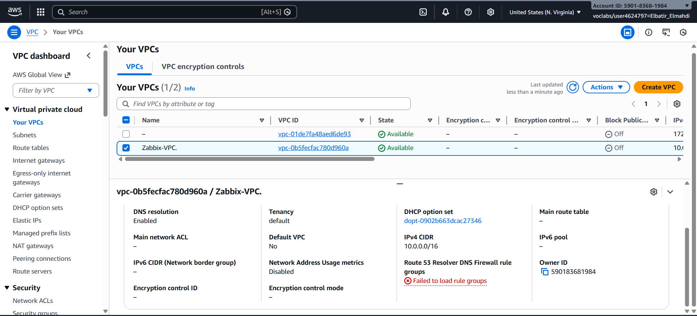

### Étape 2: Internet Gateway

1. **Internet Gateways** > **Create internet gateway**
2. **Name:** `IGW-Zabbix`
3. Attachez à `Zabbix-VPC`

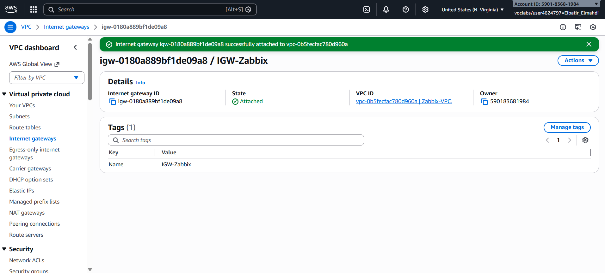

### Étape 3: Sous-réseau Public

1. **Subnets** > **Create subnet**
2. **Name:** `Public-Subnet-1`
3. **CIDR:** `10.0.1.0/24`
4. **Zone:** `us-east-1a`
5. Activez l'attribution automatique d'IP publique

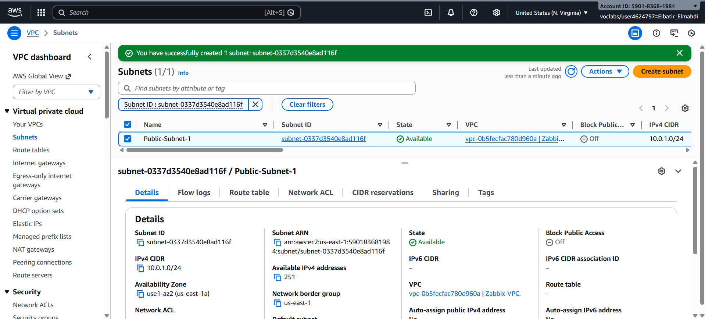

### Étape 4: Table de Routage

1. Sélectionnez la table de routage du VPC
2. Ajoutez la route: `0.0.0.0/0` → Internet Gateway

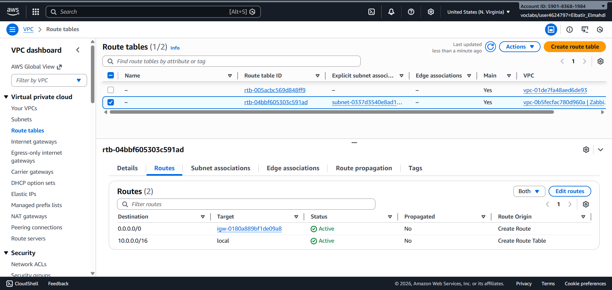

### Étape 5: Security Group

Créez le groupe `Zabbix-SG` avec les règles suivantes:

| Type | Port | Source | Description |
|------|------|--------|-------------|
| SSH | 22 | 0.0.0.0/0 | Administration Linux |
| RDP | 3389 | 0.0.0.0/0 | Administration Windows |
| HTTP | 80 | 0.0.0.0/0 | Interface Web Zabbix |
| Custom TCP | 10050 | 10.0.0.0/16 | Agent Zabbix (passif) |
| Custom TCP | 10051 | 10.0.0.0/16 | Agent Zabbix (actif) |

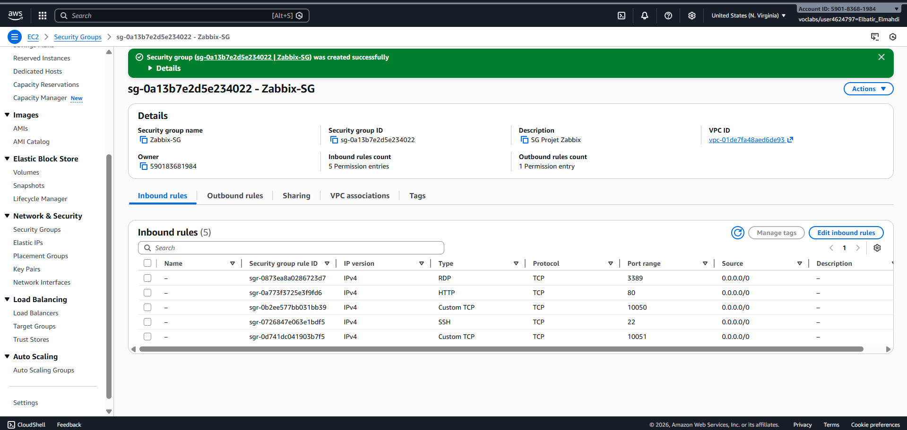

### Étape 6: Paire de Clés

1. **EC2** > **Key Pairs** > **Create key pair**
2. **Name:** `key-projet-zabbix`
3. **Format:** `.pem`


### Étape 7: Instances EC2

| Instance | Type | AMI | Rôle |
|----------|------|-----|------|
| Zabbix-Server | t3.large | Ubuntu 24.04 | Serveur de supervision |
| Client-Linux | t3.medium | Ubuntu 24.04 | Machine supervisée |
| Client-Windows | t3.large | Windows Server 2022 | Machine supervisée |

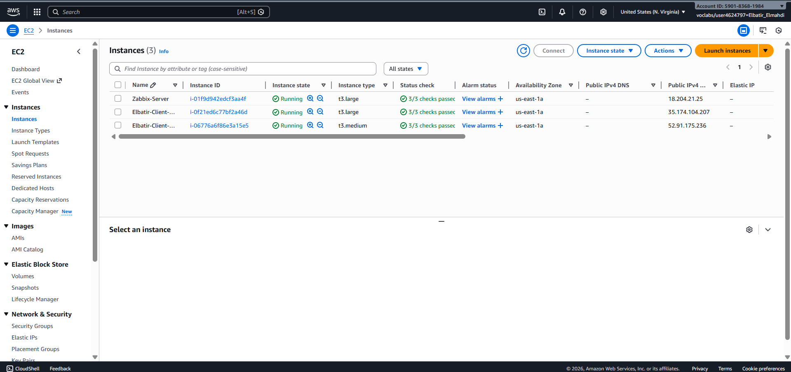

---

## Déploiement Zabbix

### Connexion au Serveur

```bash
# Sécuriser la clé (Windows PowerShell)
icacls "key-projet-zabbix.pem" /inheritance:r /grant:r "$($env:USERNAME):R"

# Connexion SSH
ssh -i key-projet-zabbix.pem ubuntu@<IP_PUBLIQUE>
```

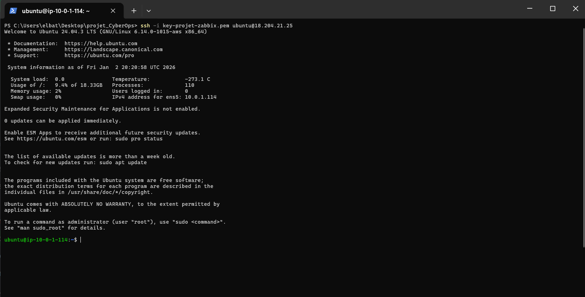

### Installation de Docker

```bash
sudo apt update && sudo apt upgrade -y
sudo apt install -y docker.io docker-compose
sudo usermod -aG docker $USER
sudo systemctl enable docker && sudo systemctl start docker
```

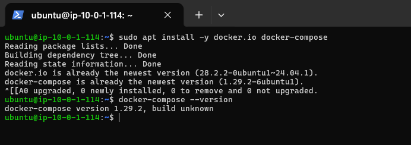

### Docker Compose

Le fichier `docker/docker-compose.yml` orchestre trois services:

```yaml
version: '3.5'
services:
  zabbix-db:
    image: mariadb:10.6
    container_name: zabbix-db
    restart: always
    environment:
      - MYSQL_DATABASE=zabbix
      - MYSQL_USER=zabbix
      - MYSQL_PASSWORD=zabbix_pwd
      - MYSQL_ROOT_PASSWORD=root_pwd
    volumes:
      - ./mysql_data:/var/lib/mysql

  zabbix-server:
    image: zabbix/zabbix-server-mysql:ubuntu-6.0-latest
    container_name: zabbix-server
    ports:
      - "10051:10051"
    environment:
      - DB_SERVER_HOST=zabbix-db
      - MYSQL_DATABASE=zabbix
      - MYSQL_USER=zabbix
      - MYSQL_PASSWORD=zabbix_pwd
    depends_on:
      - zabbix-db

  zabbix-web:
    image: zabbix/zabbix-web-nginx-mysql:ubuntu-6.0-latest
    container_name: zabbix-web
    ports:
      - "80:8080"
    environment:
      - ZBX_SERVER_HOST=zabbix-server
      - DB_SERVER_HOST=zabbix-db
      - MYSQL_DATABASE=zabbix
      - MYSQL_USER=zabbix
      - MYSQL_PASSWORD=zabbix_pwd
      - PHP_TZ=Africa/Casablanca
    depends_on:
      - zabbix-db
```

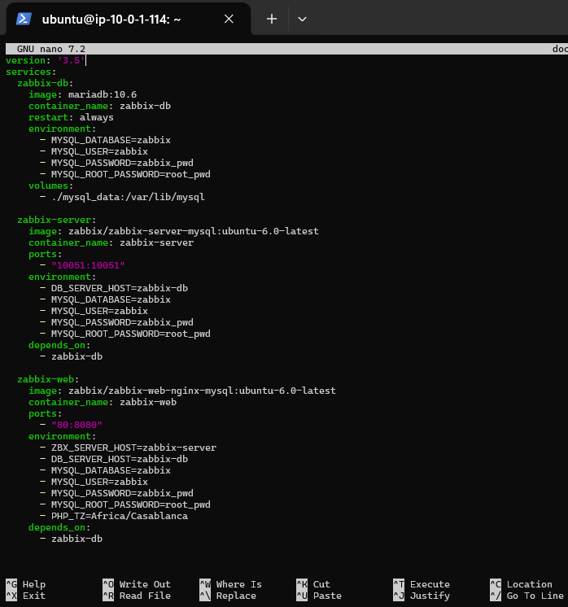

### Lancement

```bash
docker-compose up -d
docker ps
```


### Interface Web

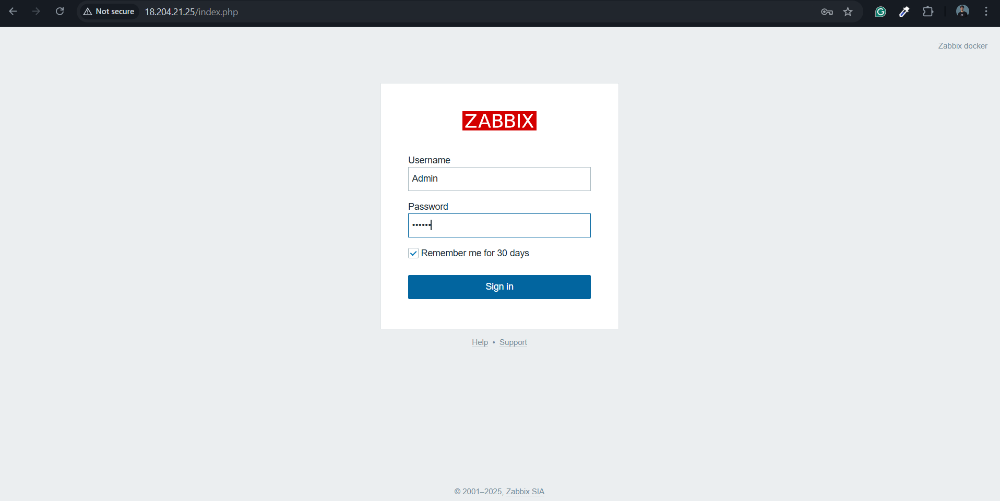

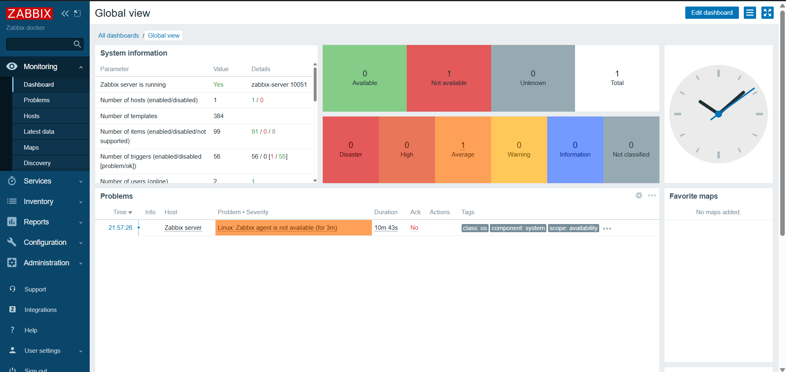

---

## Configuration des Agents

### Agent Linux (Ubuntu 24.04)

```bash
# Ajout du dépôt Zabbix
wget https://repo.zabbix.com/zabbix/6.0/ubuntu/pool/main/z/zabbix-release/zabbix-release_6.0-6+ubuntu24.04_all.deb
sudo dpkg -i zabbix-release_6.0-6+ubuntu24.04_all.deb
sudo apt update

# Installation
sudo apt install zabbix-agent -y

# Configuration (/etc/zabbix/zabbix_agentd.conf)
Server=10.0.1.252
ServerActive=10.0.1.252
Hostname=Client-Linux

# Redémarrage
sudo systemctl restart zabbix-agent
sudo systemctl enable zabbix-agent
```

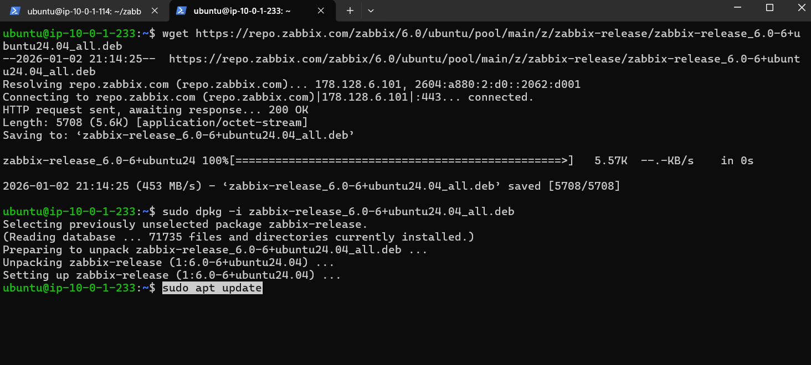

### Agent Windows

1. Téléchargez l'agent MSI depuis [zabbix.com](https://www.zabbix.com/download_agents)
2. Installez avec les paramètres:
   - **Zabbix Server IP:** `10.0.1.252`
   - **Agent Listen Port:** `10050`
   - **Hostname:** `Client-Windows`
3. Créez une règle de pare-feu pour le port 10050

---

## Monitoring et Métriques

### Visualisation des Hôtes

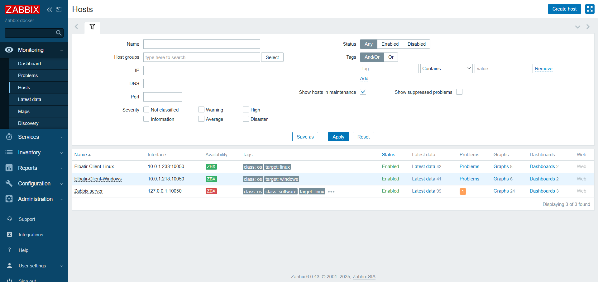

### Graphiques de Performance

#### Charge CPU
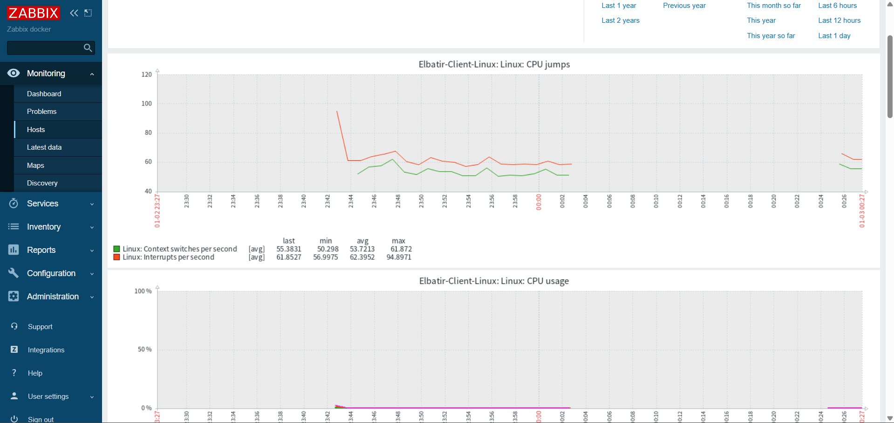

#### Utilisation RAM
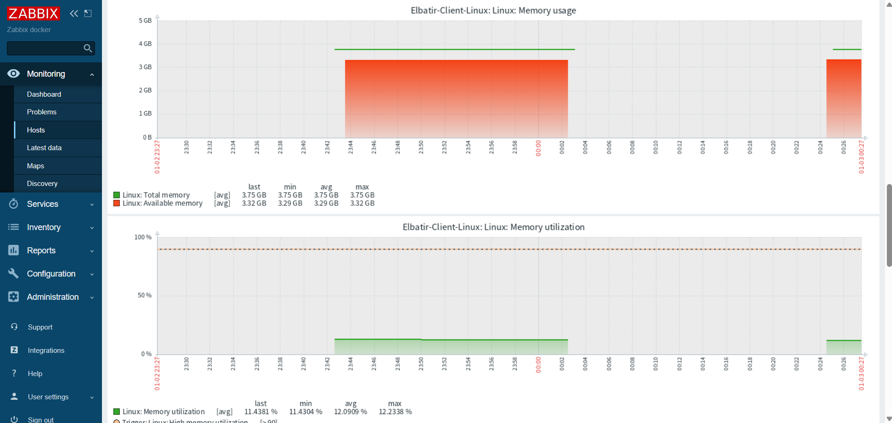

---

## Captures d'écran

<details>
<summary>Voir toutes les captures</summary>

| # | Description | Image |
|---|-------------|-------|
| 1 | Création du VPC | [01-vpc-creation.png](images/01-vpc-creation.png) |
| 2 | Internet Gateway | [02-internet-gateway.png](images/02-internet-gateway.png) |
| 3 | Sous-réseau public | [03-public-subnet.png](images/03-public-subnet.png) |
| 4 | Table de routage | [04-route-table.png](images/04-route-table.png) |
| 5 | Security Groups | [05-security-groups.png](images/05-security-groups.png) |
| 6 | Paire de clés | [06-key-pair-creation.png](images/06-key-pair-creation.png) |
| 7 | Instances EC2 | [07-ec2-instances.png](images/07-ec2-instances.png) |
| 8 | Connexion SSH | [08-ssh-connection.png](images/08-ssh-connection.png) |
| 9 | Installation Docker | [09-docker-installation.png](images/09-docker-installation.png) |
| 10 | Docker Compose | [10-docker-compose-file.png](images/10-docker-compose-file.png) |
| 11 | Conteneurs Docker | [11-docker-containers.png](images/11-docker-containers.png) |
| 13 | Login Zabbix | [13-zabbix-login.png](images/13-zabbix-login.png) |
| 14 | Dashboard Zabbix | [14-zabbix-dashboard.png](images/14-zabbix-dashboard.png) |
| 15 | Dépôt Zabbix Agent | [15-zabbix-agent-repo.png](images/15-zabbix-agent-repo.png) |
| 17 | Visualisation hôtes | [17-hosts-visualization.png](images/17-hosts-visualization.png) |
| 18 | Monitoring CPU | [18-cpu-monitoring.png](images/18-cpu-monitoring.png) |
| 19 | Monitoring RAM | [19-ram-monitoring.png](images/19-ram-monitoring.png) |

</details>

---

## Dépannage

### Problèmes Courants

| Problème | Solution |
|----------|----------|
| Connection refused sur port 10050 | Vérifiez les Security Groups AWS |
| Agent non visible dans Zabbix | Vérifiez le hostname dans la config |
| Docker Compose v1 vs v2 | Utilisez `docker-compose` ou `docker compose` |
| Base de données corrompue | Supprimez le volume et recréez |

### Commandes Utiles

```bash
# Vérifier les logs Zabbix Server
docker logs zabbix-server

# Tester la connectivité agent
telnet <IP_AGENT> 10050

# Vérifier le statut de l'agent
sudo systemctl status zabbix-agent
```

---

## Structure du Projet

```
Projet_CyberOps/
├── README.md                 # Ce fichier
├── LICENSE                   # Licence MIT
├── .gitignore               # Fichiers ignorés (clés SSH, etc.)
├── docker/
│   └── docker-compose.yml   # Orchestration Zabbix
├── scripts/
│   ├── install-docker.sh    # Installation Docker
│   └── install-zabbix-agent.sh  # Installation agent
├── config/
│   └── zabbix_agentd.conf   # Configuration agent exemple
└── images/                  # Captures d'écran
    ├── 01-vpc-creation.png
    ├── 02-internet-gateway.png
    └── ...
```

---

## Auteur

**Elmahdi Elbatir**

- Ingénierie Informatique - Big Data et Cloud Computing
- ENSET Mohammedia - Université Hassan II de Casablanca
- Contact: [GitHub Profile](https://github.com/MAHDIBATIR)

### Encadrement

- **Pr. Azeddine KHIAT** - ENSET Mohammedia

---

## Licence

Ce projet est sous licence MIT. Voir le fichier [LICENSE](LICENSE) pour plus de détails.

---

<div align="center">

**Année Universitaire 2024-2025**

N'hésitez pas à mettre une étoile si ce projet vous a été utile !

</div>
